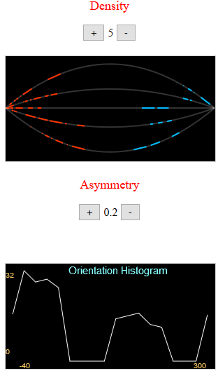

# Asymmetric-Mitosis

This program simulates stochastic videos of <a href="https://en.wikipedia.org/wiki/Microtubule_plus-end_tracking_protein">particles</a> observed with optical microscopy during the <a href="https://en.wikipedia.org/wiki/Mitosis">process of cell duplication</a>.
The asymmetry of this process <i>in the sense of the total numbers emerging from the two <a href="https://en.wikipedia.org/wiki/Microtubule_organizing_center">sources</a></i> can be interactively set and with the orientation histogram quantified.
 
Such videos provide a realistic and controllable test case for evaluation of the results obtained by image analysis programs.
A real-life video of such particles (in <a href="https://en.wikipedia.org/wiki/Interphase">a different process</a>), measured and processed at the ZMBH Imaging Facility, can be accessed <a href="./MT_13.gif">here</a>.

  

</img>

